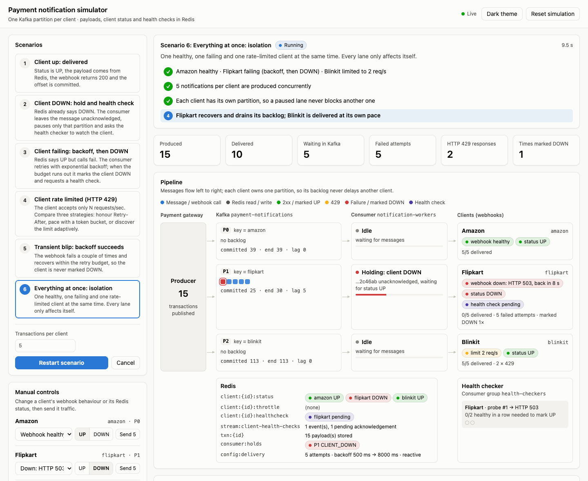
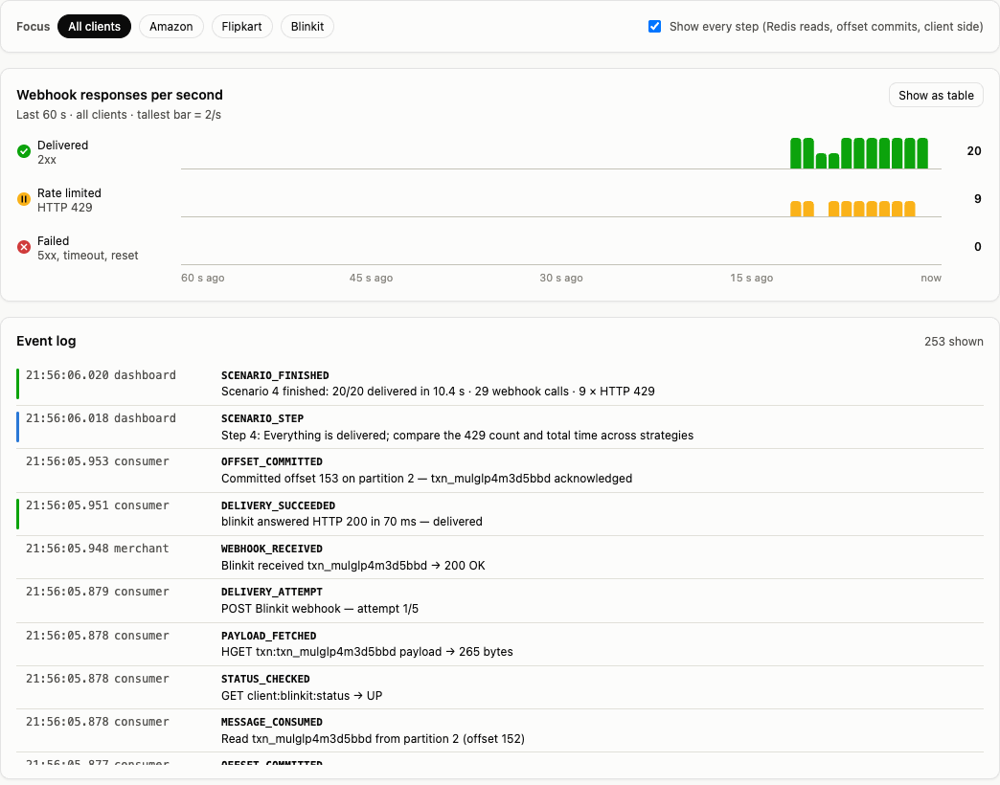
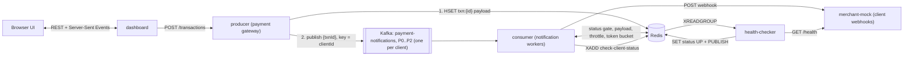
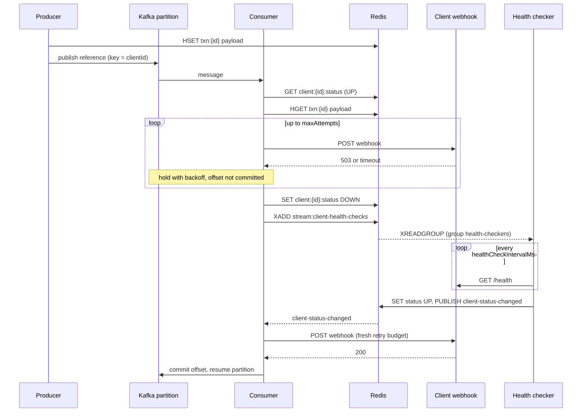

# Payment Notification Service Simulator

An end-to-end, dockerised simulation of how a payment gateway delivers transaction notifications
(webhooks) to its merchants, and how it copes when a merchant is down, failing or rate limiting.

- **Kafka** carries the notifications, with one partition per client.
- **Redis** holds the payloads, each client's status and the health-check events.
- A **live dashboard** lets you run failure scenarios and watch every step as the services
  perform it.



> **Note:** This is a learning and design aid, not production code. Read
> [Production considerations](#production-considerations) before reusing any part of it.

## Contents

- [Features](#features)
- [Quick start](#quick-start)
- [Using the dashboard](#using-the-dashboard)
- [Scenarios](#scenarios)
- [How it works](#how-it-works)
- [Handling rate-limited clients](#handling-rate-limited-clients)
- [Configuration](#configuration)
- [API reference](#api-reference)
- [Data model](#data-model)
- [Project structure](#project-structure)
- [Testing](#testing)
- [Inspecting and troubleshooting](#inspecting-and-troubleshooting)
- [Production considerations](#production-considerations)
- [Notes](#notes)

## Features

- **One partition per client.** A custom partitioner pins each client to its own Kafka
  partition, so one client's backlog never delays another.
- **Status gate.** Before calling a client, the consumer checks `client:{id}:status` in Redis.
  Clients are UP by default.
- **Unacknowledged holds.** When a client cannot be served, its message is left uncommitted and
  only that client's partition pauses. Per-client order is preserved.
- **Exponential backoff with jitter.** After the configured number of failed attempts, the
  client is marked DOWN.
- **Health checks through a Redis Stream consumer group.** Requests are de-duplicated per
  outage and survive restarts. A client is marked UP after consecutive healthy probes.
- **Rate-limit handling** with three switchable strategies: honour `Retry-After`, token bucket,
  or adaptive (AIMD).
- **Live dashboard** showing:
  - an animated pipeline;
  - the live Redis and health-checker state;
  - a per-second response chart;
  - the event log and a transactions table.
- **One command** builds and starts everything. Health checks bring the services up in the
  right order.

## Quick start

### Prerequisites

| Requirement | Notes |
|---|---|
| Docker Desktop, or Docker Engine with Compose v2 or later | Tested with Docker 29.2 and Compose 5.0 on macOS (Apple Silicon). |
| About 1 GB of free memory | The stack uses roughly 550 MB; Kafka accounts for most of it. |
| Port 8090 free on localhost | Can be changed; see [Useful variations](#useful-variations). |
| Node.js 22 or later | Only needed to run the tests locally. Not needed to run the services. |

### Run

1. Start Docker Desktop and wait until it reports that it is running.
2. Open a terminal in this folder:

   ```bash
   cd payment-notification-sim
   ```

3. Build and start all services:

   ```bash
   docker compose up --build -d --wait
   ```

   - The first run downloads the Kafka, Redis and Node base images and can take a few minutes.
   - Later starts take about 20 seconds.
   - `--wait` returns once every service reports healthy.

4. Confirm that all seven services show `healthy`:

   ```bash
   docker compose ps
   ```

5. Open <http://localhost:8090>, choose a scenario and press **Run**.

### Stop

```bash
docker compose down
```

Nothing is persisted, so the next start is clean.

### Useful variations

| Goal | Command |
|---|---|
| Run in the foreground and see all logs | `docker compose up --build` |
| Use another host port | `DASHBOARD_HOST_PORT=8095 docker compose up --build -d --wait` |
| Follow the consumer and health-checker logs | `docker compose logs -f consumer health-checker` |
| Rebuild after changing code | `docker compose up --build -d --wait` |
| Run two consumer instances | `docker compose up -d --scale consumer=2` |

The same actions are available as npm scripts: `npm run up`, `npm run down`, `npm run logs`.

## Using the dashboard

| Area | What it shows or does |
|---|---|
| **Scenarios** | Six ready-made scenarios and their parameters. Starting one cancels any scenario that is already running. |
| **Manual controls** | For each client: change the mock webhook's behaviour, set its Redis status, or send it five transactions. Behaviours: healthy; down (HTTP 503, timeout or connection reset); flaky; rate limited. |
| **Delivery settings** | Retry, timeout and health-check tuning, plus the rate-limit strategy. Stored in Redis and applied immediately. |
| **Narration** | The steps of the selected scenario. While it runs, the current step is highlighted. A result line appears at the end. |
| **Totals** | Produced, delivered, waiting in Kafka, failed attempts, HTTP 429 responses and times marked DOWN. |
| **Pipeline** | One lane per client, left to right; animated dots show each hop (the key sits above the pipeline). See the list below. |
| **Redis** and **Health checker** | Below the lanes: the live Redis keys and the probes currently in progress. |
| **Focus** | Limits the chart, event log and transactions table to one client. *Show every step* toggles low-level events: Redis reads, offset commits and client-side responses. |
| **Webhook responses per second** | Delivered, rate-limited and failed calls over the last 60 seconds. Hover for exact values, or switch to the table view. |
| **Event log** | Every event from every service, newest first. |
| **Transactions** | The latest 40 transactions and their delivery state. |

Each pipeline lane shows three things:

- **Partition:** the queued messages and the committed, end and lag offsets.
- **Consumer:** what it is doing for that client: idle, calling the webhook, counting down a
  backoff or cool-down, or holding.
- **Client:** its webhook behaviour, Redis status, any cool-down and any pending health check.

**Reset simulation** does the following:

- Returns every client to healthy and UP.
- Clears transactions and statistics.
- Skips any old backlog in Kafka.

It keeps the delivery settings; use **Restore defaults** for those.



## Scenarios

Each client plays a default role: **Amazon** is healthy, **Flipkart** has outages and **Blinkit**
rate-limits. In every scenario you can choose a different client and change the parameters.

| # | Scenario (API id) | Default setup | What happens | Run time |
|---|---|---|---|---|
| 1 | Client up: delivered (`happy-path`) | Amazon, 5 transactions | Status UP → payload read from Redis → webhook 200 → offset committed. | ~3 s |
| 2 | Client DOWN: hold and health check (`client-down`) | Flipkart already DOWN; recovers after 12 s | See [scenario 2](#scenario-2-client-already-down). | ~15 s |
| 3 | Client failing: backoff, then DOWN (`backoff-then-down`) | Flipkart UP in Redis but answering 503 | See [scenario 3](#scenario-3-client-failing). | ~20 s |
| 4 | Client rate limited (`rate-limited`) | Blinkit, 20-notification burst, limit 2 req/s | The same burst handled by the reactive, token-bucket or adaptive strategy. See [Handling rate-limited clients](#handling-rate-limited-clients). | ~12 s |
| 5 | Transient blip: backoff succeeds (`transient`) | Flipkart, 2 failed requests | Two retries absorb the blip; the client is never marked DOWN. | ~3 s |
| 6 | Everything at once: isolation (`isolation`) | Amazon healthy, Flipkart failing, Blinkit rate limited | All three problems at the same time; each stays in its own lane. | ~20 s |

### Scenario 2: client already DOWN

1. The consumer sees the DOWN status and does not call the client.
2. It leaves the message unacknowledged and pauses only Flipkart's partition, so lag builds up.
3. It adds one health-check event, and the health checker starts probing `/health`.
4. Meanwhile Amazon is still delivered.
5. After recovery the client is marked UP and its backlog is delivered in order.

### Scenario 3: client failing

1. Failed calls are retried after 0.5 s, 1 s, 2 s and 4 s.
2. After the fifth failure the consumer marks the client DOWN and requests a health check.
3. The client recovers 8 s later and is marked UP.
4. The held message is delivered with a fresh retry budget.

You can choose the failure type: HTTP 503, timeout, or connection reset.

## How it works

### Services

| Service | Internal port | Role |
|---|---|---|
| `kafka` | 9092 | Apache Kafka 3.9.1, single node in KRaft mode (no ZooKeeper). |
| `redis` | 6379 | Redis 7.4 with persistence disabled. |
| `producer` | 4100 | Payment gateway: stores the payload in Redis and publishes a reference to Kafka. |
| `consumer` | 4200 | Notification workers, in the Kafka consumer group `notification-workers`. |
| `health-checker` | 4300 | Watches DOWN clients, in the Redis Stream consumer group `health-checkers`. |
| `merchant-mock` | 4000 | Simulated client webhooks with switchable behaviour. |
| `dashboard` | 8090 | UI, control API, scenario runner and live event stream. Its port is the only one published, on 127.0.0.1. |

All Node services are built from one `Dockerfile`: Node 22 on Alpine, run as a non-root user.
They use ES modules with no build step and differ only in their start command.
`docker-compose.yml` defines a health check for every container and starts them in dependency
order.



### Lifecycle of a notification

1. **Publish.** The producer creates a transaction and writes its payload to `txn:{id}` in Redis.
   It then publishes a small reference message to `payment-notifications`, keyed by client id.
   The client partitioner sends Amazon to partition 0, Flipkart to 1 and Blinkit to 2.
2. **Consume.** The consumer receives a batch, pauses that partition and hands the batch to the
   partition's worker. The worker processes messages one at a time, in order.
3. **Gates.** Before each call the worker checks, in this order:
   1. The client's status (`client:{id}:status`; a missing key means UP). DOWN means hold.
   2. A 429 cool-down (`client:{id}:throttle`, with its TTL taken from `Retry-After`). Hold
      until it expires.
   3. A scheduled retry (`nextAttemptAt` in `txn:{id}`). Hold until then.
   4. The proactive rate limit, when the token-bucket or adaptive strategy is enabled. Hold
      until a token is available.
4. **Deliver.** The worker reads the payload from Redis and POSTs it to the client's webhook.
   The request carries `Idempotency-Key` and `X-Notification-Attempt` headers.
5. **Decide.** The response determines what happens next:

   | Webhook result | Action |
   |---|---|
   | 2xx | Mark as delivered and commit the offset. |
   | 429 | Store `client:{id}:throttle`, with a TTL equal to `Retry-After` (1 s if the header is absent), and hold. This does not use a retry attempt and never marks the client DOWN. |
   | 408, 5xx, timeout or connection error | Retry after `min(maxBackoffMs, baseBackoffMs × 2^(attempt − 1))`, with ±10% jitter. After `maxAttempts`, set the status to DOWN, request a health check and hold. |
   | Any other 4xx | Treat as permanent: dead-letter the notification (state `FAILED`) and commit. |

6. **Acknowledge.** Only acknowledged messages have their offsets committed. When a worker
   finishes its batch, the partition is resumed.

Two further rules:

- **Idempotent consumer:** a redelivered message that is already marked `DELIVERED` is
  acknowledged without calling the client again.
- **Reset:** messages produced before a simulation reset are skipped.

This sequence shows scenario 3: retries run out, then the health check brings the client back.



### Leaving a message unacknowledged

In Kafka, "unacknowledged" means the offset is not committed. The consumer never commits past a
held message, and it pauses only that client's partition. Later messages for the same client
wait behind the held one, which preserves order, while the other partitions keep flowing.

Waiting inside the message handler would stall every client. KafkaJS fetches from a broker again
only after every batch from the previous fetch has been processed. So each partition gets its
own worker, and the handler works like this:

1. It pauses the partition, hands the batch to that partition's worker and returns immediately.
2. The worker waits for as long as it needs to: a backoff, a `Retry-After` cool-down, or a DOWN
   client.
3. After each success, the worker commits the offset.
4. When its batch is finished, the worker resumes the partition.

All decision state lives in Redis: status, cool-down and the next attempt time. A restarted
consumer reads again from the last committed offset and makes the same decisions, so nothing is
lost. This was checked by restarting the consumer and the health checker while a message was
held: nothing was lost and nothing was delivered twice.

### Health checks

- **Requesting a check.** When the consumer finds a client DOWN, it sets
  `client:{id}:healthcheck` with `SET NX` and a 30 s TTL. Only if that succeeds does it add a
  "check client status" event to `stream:client-health-checks`. The result is one event per
  outage, however many messages are waiting.
- **Probing.** The health checker reads the stream with `XREADGROUP` (group `health-checkers`).
  It probes `GET /merchants/{id}/health` every `healthCheckIntervalMs` and refreshes the flag's
  TTL on each probe.
- **Marking UP.** After `healthyThreshold` consecutive successes, the health checker:
  1. sets the status to UP;
  2. deletes the flag;
  3. publishes on `client-status-changed`;
  4. acknowledges the event with `XACK`.
- **Resuming.** The consumer resumes the client's partition when it receives that message. A
  reconciliation loop runs every 3 s: it resumes holds whose client is no longer DOWN, and
  requests a new check if the flag has expired (for example after a health-checker restart).
- **Recovering events.** After a restart, the health checker re-reads the events it had not yet
  acknowledged. Every 15 s it also claims any event another instance has left idle for 60 s
  (`XAUTOCLAIM`).

## Handling rate-limited clients

An HTTP 429 means the client is **alive but overloaded**, so it must not be treated as an
outage:

- it does not consume a retry attempt;
- it never marks the client DOWN;
- it never starts a health check.

Three strategies are implemented and can be compared in scenario 4:

| Strategy | How it works | Needs the client's limit |
|---|---|---|
| Reactive | Send freely. On a 429, store `client:{id}:throttle` with a TTL equal to `Retry-After` (delay-seconds or an HTTP date, as defined in RFC 9110) and pause that partition. The key is shared, so every consumer instance backs off. | No |
| Token bucket | Before each call, take a token from a per-client bucket in Redis, refilled at 90% of the contracted rate. The 10% margin absorbs jitter. The bucket is a Lua script that uses Redis `TIME` and is shared by all instances. The consumer paces itself instead of collecting 429s, and `Retry-After` is still honoured. | Yes |
| Adaptive (AIMD) | Start at `adaptiveStartRate` (8 req/s). Halve the rate on each 429 and add 0.25 req/s on each success, converging on the real limit. | No |

Measured in this simulation with the scenario 4 defaults (a 20-notification burst against a
limit of 2 req/s) on an Apple Silicon laptop. The numbers are illustrative, not a benchmark:

| Strategy | Time to deliver 20 | Webhook calls | HTTP 429 responses |
|---|---|---|---|
| Reactive | 10.4 s | 29 | 9 |
| Token bucket | 10.2 s | 20 | 0 |
| Adaptive | 10.8 s | 25 | 5 |

**Recommendation:**

- **Default:** use a per-client token bucket at the contracted limit, and keep honouring
  `Retry-After` as a safety net. The token-bucket strategy does both.
- **Clients without a published limit:** use the adaptive strategy.
- **In all cases:**
  - keep 429s out of the DOWN and circuit-breaker logic;
  - store the cool-down in shared state rather than in one worker's memory;
  - cap how long a notification may wait before it is escalated or dead-lettered.

Other levers for a real system: per-client concurrency limits, batching several events into one
call (where the client supports it), and prioritising event types.

## Configuration

### Delivery settings

Edit these in the dashboard's **Delivery settings** panel or through `PUT /api/settings`. They
are stored in the Redis hash `config:delivery`. The consumer and health checker pick up changes
within a second.

| Setting | Default | Range | Meaning |
|---|---|---|---|
| `maxAttempts` | 5 | 1–10 | Webhook attempts before the client is marked DOWN. |
| `baseBackoffMs` | 500 | 100–10000 | First retry delay; doubles with each attempt. |
| `maxBackoffMs` | 8000 | 500–60000 | Upper limit for a single retry delay. |
| `requestTimeoutMs` | 2000 | 200–10000 | Timeout for webhook calls and health probes. |
| `rateLimitStrategy` | `reactive` | `reactive`, `token-bucket`, `adaptive` | How 429 responses are avoided or handled. |
| `defaultRetryAfterMs` | 1000 | 100–30000 | Cool-down after a 429 that has no `Retry-After` header. API only. |
| `adaptiveStartRate` | 8 | 0.5–50 | Starting rate (req/s) for the adaptive strategy. API only. |
| `healthCheckIntervalMs` | 2000 | 500–30000 | Time between health probes. |
| `healthyThreshold` | 2 | 1–5 | Consecutive healthy probes needed to mark a client UP. |

### Environment variables

These are set in `docker-compose.yml`. The defaults suit running a service directly on your
machine.

| Variable | Used by | Default |
|---|---|---|
| `KAFKA_BROKERS` | producer, consumer, dashboard | `localhost:9092` (compose: `kafka:9092`) |
| `REDIS_URL` | all Node services | `redis://localhost:6379` |
| `NOTIFICATION_TOPIC` | producer, consumer, dashboard | `payment-notifications` |
| `CONSUMER_GROUP` | consumer, dashboard | `notification-workers` |
| `PRODUCER_URL` | dashboard | `http://localhost:4100` |
| `MERCHANT_URL` | consumer, health checker, dashboard | `http://localhost:4000` |
| `MERCHANT_PORT`, `PRODUCER_PORT`, `CONSUMER_PORT`, `HEALTH_CHECKER_PORT`, `DASHBOARD_PORT` | the matching service | `4000`, `4100`, `4200`, `4300`, `8090` |
| `HEALTH_CHECKER_ID` | health checker | `checker-1` |
| `DASHBOARD_HOST_PORT` | Docker Compose (host side) | `8090` |

### Clients

Clients are defined in `CLIENTS` in `src/shared/config.js`:

| Client | Id | Partition | Contracted limit |
|---|---|---|---|
| Amazon | `amazon` | 0 | 10 req/s |
| Flipkart | `flipkart` | 1 | 10 req/s |
| Blinkit | `blinkit` | 2 | 2 req/s |

The contracted limit is the rate the token-bucket strategy paces against. Scenario 4 overrides
it with its own "Client limit" parameter.

To add, remove or rename a client, edit that list, then restart from scratch:

```bash
docker compose down
docker compose up --build -d --wait
```

The topic gets one partition per client, and Kafka cannot remove partitions from an existing
topic, which is why `down` is needed first.

## API reference

The dashboard serves these endpoints on port 8090. All request and response bodies are JSON.

| Method | Path | Purpose |
|---|---|---|
| GET | `/api/meta` | Clients, scenarios (with parameters and steps) and default settings. |
| GET | `/api/state` | Latest snapshot. See the fields below. |
| GET | `/api/stream` | Server-Sent Events. See the event types below. |
| POST | `/api/scenarios/{id}` | Start a scenario. The optional body holds its parameters. Cancels a running scenario. |
| POST | `/api/scenario/cancel` | Cancel the running scenario. |
| POST | `/api/reset` | Reset the simulation. |
| POST | `/api/transactions` | Produce transactions: `{ "clientId", "count" (1–200), "intervalMs" (0–10000) }`. |
| PUT | `/api/clients/{id}/behavior` | Change the mock webhook's behaviour (fields below). |
| PUT | `/api/clients/{id}/status` | Set the Redis status: `{ "status": "UP" }` or `{ "status": "DOWN" }`. |
| PUT | `/api/settings` | Update delivery settings (any subset). |
| POST | `/api/settings/reset` | Restore the default delivery settings. |

The snapshot from `/api/state` contains:

- clients, with status, cool-down, pending health check, statistics and mock behaviour;
- partitions, with offsets, lag and holds;
- the active health monitors;
- the latest 40 transactions;
- the delivery settings;
- the current scenario.

`/api/stream` sends these event types:

| Event | Contents |
|---|---|
| `hello` | Recent events plus the current snapshot, sent on connect. |
| `snapshot` | The full snapshot, every 600 ms. |
| `sim` | One event per service action. |
| `reset` | Sent when the simulation is reset. |

Behaviour fields for `PUT /api/clients/{id}/behavior`:

| Field | Values |
|---|---|
| `mode` | `HEALTHY`, `DOWN`, `FLAKY` or `RATE_LIMITED` |
| `failureStyle` | `HTTP_503`, `HTTP_500`, `TIMEOUT` or `CONNECTION_RESET` |
| `failNext` | For `FLAKY`: how many requests fail before it recovers |
| `rateLimitPerSec`, `retryAfterSec` | For `RATE_LIMITED` |
| `latencyMs` | Simulated response time |
| `recoverAfterMs` | Return to healthy after this many milliseconds |

Examples:

```bash
# Run scenario 4 with the token-bucket strategy and a larger burst
curl -X POST localhost:8090/api/scenarios/rate-limited \
  -H 'content-type: application/json' -d '{"strategy":"token-bucket","count":30}'

# Make Flipkart's webhook hang, and recover by itself after 15 seconds
curl -X PUT localhost:8090/api/clients/flipkart/behavior \
  -H 'content-type: application/json' -d '{"mode":"DOWN","failureStyle":"TIMEOUT","recoverAfterMs":15000}'

# Send 10 transactions for Amazon, 200 ms apart
curl -X POST localhost:8090/api/transactions \
  -H 'content-type: application/json' -d '{"clientId":"amazon","count":10,"intervalMs":200}'
```

## Data model

### Kafka

- The topic `payment-notifications` has one partition per client and replication factor 1.
  Automatic topic creation is disabled; the services create the topic when they start.
- **Message key:** the client id. There is also a `client-id` header.
- **Message value:** a reference only. The payload stays in Redis:

  ```json
  {
    "txnId": "txn_mulgmzxu61c7b3",
    "eventId": "evt_mulgmzxub023b1",
    "clientId": "blinkit",
    "type": "payment.captured",
    "epoch": 1790612752817,
    "producedAt": 1790612816754
  }
  ```

- **Consumer group:** `notification-workers`, with manual offset commits. `epoch` lets a reset
  skip older messages.

### Webhook request

This is what a client receives:

```http
POST /merchants/blinkit/webhook
Content-Type: application/json
Idempotency-Key: evt_mulglp4mfd9a97
X-Notification-Attempt: 1

{
  "id": "evt_mulglp4mfd9a97",
  "type": "payment.failed",
  "createdAt": "2026-09-28T16:25:56.086Z",
  "data": {
    "transactionId": "txn_mulglp4m3d5bbd",
    "orderId": "order_mulglp4m3de73e",
    "clientId": "blinkit",
    "amount": 22555.34,
    "currency": "INR",
    "method": "NETBANKING",
    "status": "FAILED"
  }
}
```

All transaction data is randomly generated. It contains no card or personal data.

### Redis keys

| Key | Type | Written by | Meaning |
|---|---|---|---|
| `txn:{id}` | hash | producer, consumer | The payload plus delivery state: `state`, `attempts`, `totalAttempts`, `nextAttemptAt`, `lastResult`, `partition`, `offset` and timestamps. Expires after 24 h. |
| `txns:recent` | sorted set | producer | The latest 500 transaction ids, for the UI. |
| `client:{id}:status` | string | dashboard, consumer, health checker | `UP` or `DOWN`; a missing key means UP. |
| `client:{id}:throttle` | string with TTL | consumer | Present during a 429 cool-down. |
| `client:{id}:healthcheck` | string with TTL | consumer, health checker | De-duplication flag while a health check is pending. |
| `client:{id}:ratelimit` | string | dashboard | Contracted req/s for the token bucket, set by scenario 4. |
| `client:{id}:bucket` | hash | consumer | Token bucket state. |
| `client:{id}:adaptive-rate` | string | consumer | Rate discovered by the adaptive strategy. |
| `stats:client:{id}` | hash | producer, consumer | Counters shown in the UI. |
| `stream:client-health-checks` | stream | consumer (read by health checker) | "Check client status" events, consumer group `health-checkers`. |
| `config:delivery` | hash | dashboard | Delivery settings. |
| `consumer:holds` | hash | consumer | Current partition holds, for the UI. |
| `health:monitors` | hash | health checker | Probes in progress, for the UI. |
| `sim:epoch` | string | dashboard | Reset marker; older messages are skipped. |
| `client-status-changed` | pub/sub channel | consumer, health checker, dashboard | Status changes; the consumer resumes partitions on UP. |
| `sim:control` | pub/sub channel | dashboard | Reset command. |
| `sim:events` | pub/sub channel | all services | Visualisation events for the dashboard. |

## Project structure

```
payment-notification-sim/
├── docker-compose.yml      Kafka, Redis and the five Node services
├── Dockerfile              one image for every Node service
├── package.json            dependencies (kafkajs, ioredis) and npm scripts
├── src/
│   ├── shared/             configuration, client registry, Redis keys, Kafka/Redis/HTTP helpers
│   ├── producer/           payment gateway and client partitioner
│   ├── consumer/           Kafka wiring, partition worker, delivery gates, policy, rate limiter
│   ├── health-checker/     Redis Stream consumer and probe loop
│   ├── merchant-mock/      simulated client webhooks
│   └── dashboard/          UI server, scenario runner, state snapshots
├── public/                 dashboard UI (plain HTML, CSS and JavaScript)
├── test/                   unit tests (node:test)
├── scripts/smoke.mjs       end-to-end test of every scenario
└── docs/                   screenshots used in this README
```

## Testing

### Unit tests

```bash
nvm use 22      # the tests need Node 22 or later
npm install
npm test
```

The nine tests cover:

- response classification and `Retry-After` parsing;
- the backoff calculation and the AIMD rate rule;
- the client partitioner;
- the partition worker's hold and acknowledge behaviour.

### End-to-end smoke test

With the stack running:

```bash
npm run smoke
```

The smoke test runs every scenario through the API, including scenario 4 with all three
strategies, and prints a PASS or FAIL line for each run. It takes about 90 seconds. It resets the
simulation and the delivery settings before and after.

```
PASS happy-path                       3/3 delivered in 0.9 s · 3 calls
PASS client-down                      6/6 delivered in 8.3 s · 6 calls
PASS backoff-then-down                2/2 delivered in 14.5 s · 7 calls
PASS rate-limited (reactive)          10/10 delivered in 4.8 s · 14 calls · 4 × 429
PASS rate-limited (token-bucket)      10/10 delivered in 4.6 s · 10 calls · 0 × 429
PASS rate-limited (adaptive)          10/10 delivered in 5.0 s · 13 calls · 3 × 429
PASS transient                        2/2 delivered in 1.9 s · 4 calls
PASS isolation                        9/9 delivered in 18.5 s · 15 calls
```

### Scaling the consumer

```bash
docker compose up -d --scale consumer=2
```

The two instances split the partitions between them. Holds, cool-downs and retry schedules live
in Redis, so either instance makes the same decisions; the smoke test also passes in this
configuration. Return to a single instance with `--scale consumer=1`.

## Inspecting and troubleshooting

### Looking inside the running system

```bash
docker compose ps
docker compose logs -f consumer health-checker
docker compose exec redis redis-cli --scan --pattern 'client:*'
docker compose exec redis redis-cli hgetall config:delivery
docker compose exec redis redis-cli xinfo groups stream:client-health-checks
docker compose exec kafka /opt/kafka/bin/kafka-consumer-groups.sh \
  --bootstrap-server localhost:9092 --describe --group notification-workers
docker compose exec kafka /opt/kafka/bin/kafka-topics.sh \
  --bootstrap-server localhost:9092 --describe --topic payment-notifications
docker compose exec consumer wget -qO- http://127.0.0.1:4200/workers
docker compose exec health-checker wget -qO- http://127.0.0.1:4300/monitors
```

Inside the containers, use `127.0.0.1` rather than `localhost`. On Alpine, `localhost` resolves
to IPv6 first, and the services listen on IPv4.

### Common problems

| Symptom | Fix |
|---|---|
| `Cannot connect to the Docker daemon` | Start Docker Desktop and run the command again. |
| `port is already allocated` or `address already in use` for port 8090 | Choose another port, for example `DASHBOARD_HOST_PORT=8095 docker compose up -d --wait`, and open that port. |
| `--wait` fails, or a service stays unhealthy | Check `docker compose logs <service>`. Kafka can need extra time on the first start; run the same command again. |
| The page shows "Reconnecting…" | The dashboard container is restarting or stopped; check `docker compose ps`. The page reconnects by itself. |
| UI changes do not appear | The UI files are built into the image. Run `docker compose up --build -d --wait dashboard`. |
| Lanes are missing or extra after editing `CLIENTS` | Run `docker compose down`, then `docker compose up --build -d --wait`. |
| `npm test` fails with syntax errors | Your Node version is too old. Run `nvm use 22`. |
| KafkaJS logs "group coordinator is not available" or "group is rebalancing" | Normal at start-up and when a consumer joins or leaves. Both resolve on their own. |

## Production considerations

This simulation takes several shortcuts. Review the following with the owning engineering and
security teams before building anything real:

- **Payload storage.** As specified, payloads live in Redis, and persistence is disabled here.
  Use a durable store instead: Redis with AOF and replication, or a database. Alternatively,
  carry the payload in the Kafka message.
- **One partition per client** suits a small set of large clients. With many clients, partition
  by a hash of the client id. Then add per-client retry or parking queues, so that one blocked
  client does not hold up others that share its partition.
- **Kafka** runs as a single broker with replication factor 1. Use at least three brokers,
  `min.insync.replicas=2`, and producer `acks=all` with idempotence.
- **Kafka client.** KafkaJS has had no release since 2023. For production, evaluate a maintained
  client such as `@confluentinc/kafka-javascript`.
- **Dead letters** are only recorded in Redis. Add a dead-letter topic, a maximum notification
  age, alerting and a replay tool.
- **Webhook security.** Sign payloads, for example with an HMAC signature header and per-client
  secrets held in a secrets manager. Enforce HTTPS and restrict outbound destinations.
- **The dashboard** has no authentication and is meant for local use only.
- **Observability.** Add metrics (lag, delivery latency, retries, 429s, time spent DOWN),
  tracing, and alerts on long holds.

## Notes

- Amazon, Flipkart and Blinkit are labels for simulated merchants only. The simulation does not
  connect to, or represent, those companies' systems.
- Run times and rate-limit figures in this README were measured on one machine and will vary.
